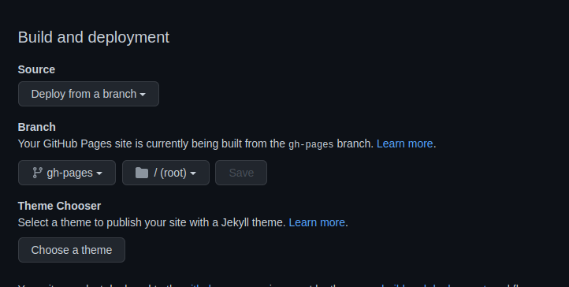

<h1 align="center">LinkLeaf</h1>

    

A similar project to Linktree that can be hosted on Github Pages

[Demo](https://tekofx.github.io/linkleaf)

# How to get it ready

- Fork the repository
- Edit the `src/data.json` file with your data and push it to your repo
  - The icons are from [Font Awesome](https://fontawesome.com/icons?d=gallery). You can use whatever icon you want.
- Enable github pages in the settings of your repo. Go to Setting>Pages and set source: Deploy from branch and select `gh-pages` brach
    
  
- Now your LinkLeaf should be located on `https://{GITHUB_USERNAME}.github.io/linkleaf`

# Customization

## Change avatar

- Change `public/avatar.jpg` to your own avatar with .jpg extension

## Change background

There are two options: Use a color or use an image.

### Color

Just change the backgroundColor variable in `src/data.json` to your desired color.

### Image

- Remove the backgroundColor variable in `src/data.json`
- Change `public/background.jpg` to your own background with .jpg extension
